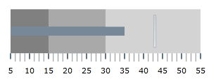
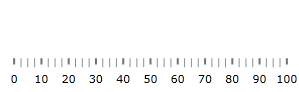
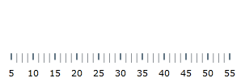
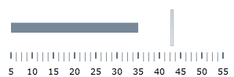

////
|metadata|
{
    "name": "bulletgraph-adding",
    "controlName": ["{BulletGraphName}"],
    "tags": ["Application Scenarios","Charting","Getting Started","How Do I"],
    "guid": "1d4c8246-db15-476a-b025-68aaf9a4a630",
    "buildFlags": [],
    "createdOn": "2014-06-05T19:53:11.991864Z"
}
|metadata|
////

= Adding Bullet Graph

== Topic Overview

=== Purpose

This topic explains how to add the  _{BulletGraphName}_™ control to an {PlatformName} application.

=== Required background

The following topics are prerequisites to understanding this topic:

[options="header", cols="a,a"]
|====
|Topic|Purpose

| link:bulletgraph-overview.html[ _{BulletGraphName}_ Overview]
|This topic provides conceptual information about the _{BulletGraphName}_ control including its main features, minimum requirements, and user functionality.

|====

=== In this topic

This topic contains the following sections:

* <<_Ref361648034, Adding {BulletGraphName}   – Conceptual Overview >>

** <<_Ref361648039,Adding  _{BulletGraphName}_   summary>>
** <<_Ref361648047,Requirements>>
** <<_Ref361648052,Steps>>

* <<_Ref361422086, Adding {BulletGraphName}   – Code Example >>

** <<_Ref361648073,Introduction>>
** <<_Preview,Preview>>
** <<_Ref361648084,Prerequisites>>
** <<_Overview,Overview>>
** <<_Ref361648095,Steps>>

* <<_Ref357677916, Related Content >>

** <<_Ref361648114,Topics>>
** <<_Ref361648123,Samples>>

[[_Ref361648034]]
[[_Ref357677909]]
== Adding  _{BulletGraphName}_   – Conceptual Overview

[[_Ref361648039]]

=== Adding {BulletGraphName} summary

To add  _{BulletGraphName}_   to a page, you need to create an instance of the control and add it to your page’s root element. The control is pre-configured to display a scale with values varying from 0 to 100, major and minor tick marks, and, by default, it takes the size of the container it is placed into.

[[_Ref361648047]]

=== Requirements

Following are the general requirements for adding the  _{BulletGraphName}_   control.

[options="header", cols="a,a"]
|====
|Requirement|References/Description

ifdef::wpf,win-universal,win-forms[]
|Assembly references
|
* {ApiPlatform}{ApiVersion}.dll 

* {ApiPlatform}DataVisualization{ApiVersion}.dll 

* {ApiPlatform}{BulletGraphAssembly}{ApiVersion}.dll 

endif::wpf,win-universal,win-forms[]

ifdef::xamarin[]
|Assembly references
|
* {ApiPlatform}dll 

* {ApiPlatform}{BulletGraphAssembly}.dll 

endif::xamarin[]

ifdef::android[]
|Jars references
|
* infragistics.dv.shared.jar 

* infragistics.gauges.jar 

* infragistics.ui.jar 

endif::android[]

|Namespace references
|
ifdef::wpf,win-universal[] 

*In XAML:*

---- 
xmlns:ig="http://schemas.infragistics.com/xaml"
---- 

endif::wpf,win-universal[] 

ifdef::xamarin[] 

*In XAML:*

---- 
xmlns:ig="clr-namespace:Infragistics.XF.Controls;assembly={ApiPlatform}Controls.Gauges"
---- 

endif::xamarin[] 

ifdef::xaml,win-forms[] 

*In C#:*

[source,csharp]
---- 
using {BulletGraphNamespace};
---- 

*In Visual Basic:*

[source,vb]
---- 
Imports {BulletGraphNamespace}
---- 

endif::xaml,win-forms[] 

ifdef::android[] 

*In Java:*

[source,js]
---- 
import com.infragistics.controls.BulletGraphView; import com.infragistics.controls.LinearGraphRange; 
---- 

endif::android[] 

|====

.Note
[NOTE]
====
For details, refer to link:bulletgraph-api-reference.html[Assemblies].
====

[[_Ref361648052]]

=== Steps

Following are the general conceptual steps for adding  _{BulletGraphName}_  .

*1. Adding the  _{BulletGraphName}_  control*

*2. Configuring the scale*

*3. Configuring the performance bar*

*4. Configuring the comparative marker*

*5. Configuring additional aspects*  (For details, see <<_Ref361422086,Adding  _{BulletGraphName}_  – Code Example>> and link:bulletgraph-configuring.html[Configuring  _{BulletGraphName}_ ].)

[[_Ref361422086]]
== Adding  _{BulletGraphName}_   – Code Example

[[_Ref361648073]]

=== Introduction

The following procedure walks through instantiating a pick:[android="n"]   _{BulletGraphName}_   control, adding it to a {PlatformName} application, and configuring a performance bar, comparative measure marker, and three comparative ranges on the scale.

[[_Preview]]

=== Preview

The following screenshot is a preview of the final result.

[[_Ref361648084]]

=== Prerequisites

To complete the procedure, you need the following:

* An {ProductName} project with a page
* The required assembly references and namespaces added to the project (See <<_Ref361648047,Requirements>>.)

ifdef::android[]
* The required jars added to the project (See <<_Ref361648047,Requirements>>.)

endif::android[]

[[_Overview]]

=== Overview

Following is a conceptual overview of the process:

*1. Adding the  _{BulletGraphName}_  control*

*2. Configuring the scale*

*3. Configuring the performance bar*

*4. Configuring the comparative marker*

*5. Adding comparative ranges*

[[_Ref361648095]]

=== Steps

The following steps demonstrate how to add the  _{BulletGraphName}_   control to an application.

=== 1. Add the {BulletGraphName} control.

*Add a*   _{BulletGraphName}_    *declaration to your page’s root*  `Grid`  *element and set its desired*  `Height`  *and*  `Width` *.*

ifdef::xaml[]

*In XAML:*

[source,xaml]
----
<ig:{BulletGraphName} x:Name="bulletGraph"
                   Height="100"
                   Width="300">
</ig:{BulletGraphName}>
----

endif::xaml[]

ifdef::xaml,win-forms[]

*In C#:*

[source,csharp]
----
XamBulletGraph bulletGraph = new XamBulletGraph();
bulletGraph.Height = 100;
bulletGraph.Width = 300;
----

*In Visual Basic:*

[source,vb]
----
Dim bulletGraph As New XamBulletGraph()
bulletGraph.Height = 100
bulletGraph.Width = 300
----

endif::xaml,win-forms[]

ifdef::android[]

*In Java:*

[source,js]
----
BulletGraphView bulletGraph = new BulletGraphView(rootView.getContext());
int height = (int) TypedValue.applyDimension(TypedValue.COMPLEX_UNIT_DIP,
        100, getResources().getDisplayMetrics());
int width = (int) TypedValue.applyDimension(TypedValue.COMPLEX_UNIT_DIP,
        300, getResources().getDisplayMetrics());
RelativeLayout.LayoutParams params = new RelativeLayout.LayoutParams(width,height);
bulletGraph.setLayoutParams(params);
----

endif::android[]

This declaration would instantiate  _{BulletGraphName}_   with its link:bulletgraph-overview.html#_Ref361168550[default look] and link:bulletgraph-overview.html#_Ref361168497[settings] and fixed size. This means that the scale would display the 0÷100 range with major and minor tick marks so it would need some additional configuring.

=== 2. Configure the scale.

In order  *to customize the values of the scale,*   *you need to set its*  `MinimumValue`  *and*  `MaximumValue`  *properties* . In this example, the scale will start at 5 and end at 55.

ifdef::xaml[]

*In XAML:*

[source,xaml]
----
<ig:{BulletGraphName} x:Name="bulletGraph"
                   MinimumValue="5"
                   MaximumValue="55">
</ig:{BulletGraphName}>
----

endif::xaml[]

ifdef::xaml,win-forms[]

*In C#:*

[source,csharp]
----
bulletGraph.MaximumValue = 55;
bulletGraph.MinimumValue = 5;
----

*In Visual Basic:*

[source,vb]
----
bulletGraph.MaximumValue = 55
bulletGraph.MinimumValue = 5
----

endif::xaml,win-forms[]

ifdef::android[]

*In Java:*

[source,js]
----
bulletGraph.setMinimumValue(5);
bulletGraph.setMaximumValue(55);
----

endif::android[]

The changed scale is shown on the following screenshot:

=== 3. Add performance bar.

The primary measure of the  _{BulletGraphName}_   is visualized by its performance bar. Its value is managed by the `Value` property setting. For this example,  *set the*  `Value`  *property*  to 35.

ifdef::xaml[]

*In XAML:*

[source,xaml]
----
<ig:{BulletGraphName} x:Name="bulletGraph"
                   Value="35">
</ig:{BulletGraphName}>
----

endif::xaml[]

ifdef::xaml,win-forms[]

*In C#:*

[source,csharp]
----
bulletGraph.Value = 35;
----

*In Visual Basic:*

[source,vb]
----
bulletGraph.Value = 35
----

endif::xaml,win-forms[]

ifdef::android[]

*In Java:*

[source,js]
----
bulletGraph.setValue(35);
----

endif::android[]

=== 4. Configure the comparative marker.

The position of the comparative measure marker on the scale is managed by the value of the `TargetValue` property. For this example,  *set the*  `TargetValue`  *property*  to 43.

ifdef::xaml[]

*In XAML:*

[source,xaml]
----
<ig:{BulletGraphName} x:Name="bulletGraph"
                   TargetValue="43">
</ig:{BulletGraphName}>
----

endif::xaml[]

ifdef::xaml,win-forms[]

*In C#:*

[source,csharp]
----
bulletGraph.TargetValue = 43;
----

*In Visual Basic:*

[source,vb]
----
bulletGraph.TargetValue = 43
----

endif::xaml,win-forms[]

ifdef::android[]

*In Java:*

[source,js]
----
bulletGraph.setTargetValue(43);
----

endif::android[]

The following screenshot displays what the  _{BulletGraphName}_   control would look so far in the procedure.

=== 5. Add comparative ranges.

In order to compare the value displayed by the performance bar against some meaningful range(s) of values, these comparative ranges need to be displayed on the scale. Comparative ranges are managed by `Ranges` property within which several individual `{BulletGraphRange}s` can be defined, each of which having its own starting and ending values (`StartValue` and `EndValue`) and color (`Brush`).

For this example, configure 3 comparative ranges, each of a different shade of gray, starting at the 0, 15, and 30 tick marks of the scale, respectively.

ifdef::xaml[]

*In XAML:*

[source,xaml]
----
<ig:{BulletGraphName} x:Name="bulletGraph" >
    <ig:{BulletGraphName}.Ranges>
        <ig:{BulletGraphRange} StartValue="0"
                                EndValue="15"
                                Brush="Gray"/>
        <ig:{BulletGraphRange} StartValue="15"
                                EndValue="30"
                                Brush="DarkGray"/>
        <ig:{BulletGraphRange} StartValue="30"
                                EndValue="55"
                                Brush="LightGray"/>
    </ig:{BulletGraphName}.Ranges>
</ig:{BulletGraphName}>
----

endif::xaml[]

ifdef::xaml,win-forms[]

*In C#:*

[source,csharp]
----
XamLinearGraphRange range1 = new XamLinearGraphRange();
range1.StartValue = 0;
range1.EndValue = 15;
range1.Brush = new SolidColorBrush(Color.FromRgb(47, 47, 47));

XamLinearGraphRange range2 = new XamLinearGraphRange();
range2.StartValue = 15;
range2.EndValue = 30;
range2.Brush = new SolidColorBrush(Color.FromRgb(158, 158, 158));

XamLinearGraphRange range3 = new XamLinearGraphRange();
range3.StartValue = 30;
range3.EndValue = 55;
range3.Brush = new SolidColorBrush(Color.FromRgb(198, 198, 198));

bulletGraph.Ranges.Add(range1);
bulletGraph.Ranges.Add(range2);
bulletGraph.Ranges.Add(range3);
bulletGraph.TargetValueBrush = new SolidColorBrush(Color.FromRgb(255, 255, 255));
----

*In Visual Basic:*

[source,vb]
----
Dim range1 As New XamLinearGraphRange()
range1.StartValue = 0
range1.EndValue = 15
range1.Brush = New SolidColorBrush(Color.FromRgb(47, 47, 47))

Dim range2 As New XamLinearGraphRange()
range2.StartValue = 15
range2.EndValue = 30
range2.Brush = New SolidColorBrush(Color.FromRgb(158, 158, 158))

Dim range3 As New XamLinearGraphRange()
range3.StartValue = 30
range3.EndValue = 55
range3.Brush = New SolidColorBrush(Color.FromRgb(198, 198, 198))

bulletGraph.Ranges.Add(range1)
bulletGraph.Ranges.Add(range2)
bulletGraph.Ranges.Add(range3)
bulletGraph.TargetValueBrush = New SolidColorBrush(Color.FromRgb(255, 255, 255))
----

endif::xaml,win-forms[]

ifdef::android[]

*In Java:*

[source,js]
----
LinearGraphRange lgrange1 = new LinearGraphRange(); 
lgrange1.setStartValue(0); 
lgrange1.setEndValue(15); 
lgrange1.setBrush(new SolidColorBrush(Color.DKGRAY));
LinearGraphRange lgrange2 = new LinearGraphRange();
lgrange2.setStartValue(15);
lgrange2.setEndValue(30) ;
lgrange2.setBrush(new SolidColorBrush(Color.GRAY));
LinearGraphRange lgrange3 = new LinearGraphRange();
lgrange3.setStartValue(30);
lgrange3.setEndValue(55) ;
lgrange3.setBrush(new SolidColorBrush(Color.LTGRAY));
bulletGraph.addRange(lgrange1);
bulletGraph.addRange(lgrange2);
bulletGraph.addRange(lgrange3);
bulletGraph.setValueBrush(new SolidColorBrush(Color.BLACK));
bulletGraph.setTargetValueBrush(new SolidColorBrush(Color.WHITE));
----

endif::android[]

The final look of the graph is presented below.

[[_Ref357677916]]
== Related Content

[[_Ref361648114]]

=== Topics

The following topics provide additional information related to this topic.

[options="header", cols="a,a"]
|====
|Topic|Purpose

| link:bulletgraph-configuring.html[Configuring _{BulletGraphName}_ ]
|This is a group of topics explaining how to configure the various aspects of the _{BulletGraphName}_ control including its orientation and direction and visual elements.

| link:bulletgraph-api-reference.html[API Reference ( _{BulletGraphName}_ )]
|This topic provides reference information about the key classes and properties related to the _{BulletGraphName}_ control.

| link:bulletgraph-known-issues-and-limitations.html[Known Issues and Limitations ( _{BulletGraphName}_ )]
|This topic provides information about the known issues and limitations of the _{BulletGraphName}_ control.

|====

ifdef::wpf,sl[]

[[_Ref361648123]]

=== Samples

ifdef::wpf,sl[]

The following samples provide additional information related to this topic.

[cols="a,a"]
|====
ifdef::wpf,sl[]
|Sample|Purpose
endif::wpf,sl[]

ifdef::wpf,sl[]
|
ifdef::sl[] 

link:{SamplesURL}/bullet-graph/#/basic-configuration[Basic Configuration] 

endif::sl[] 

ifdef::wpf[] 

link:{SamplesURL}/bullet-graph/basic-configuration[Basic Configuration] 

endif::wpf[]
|This sample demonstrates a simple configuration of the _{BulletGraphName}_ control.
endif::wpf,sl[]

|====

endif::wpf,sl[]

endif::wpf,sl[]